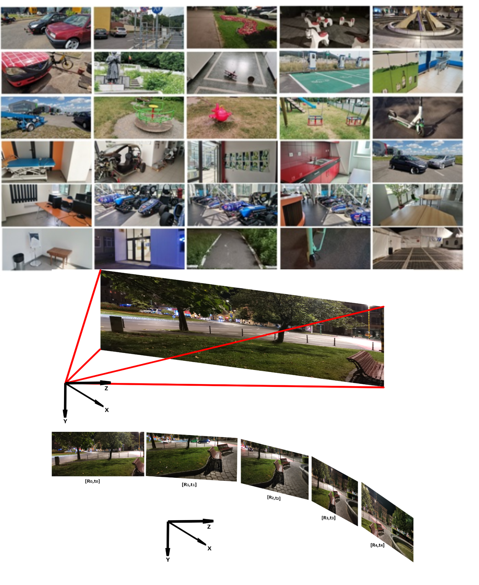

# LoopDB: A Loop Closure Dataset for SLAM

[](https://opensource.org/licenses/MIT)

## Overview

LoopDB is a challenging loop closure dataset comprising over 1000 high-resolution images captured across diverse environments, including parks, indoor scenes, parking spaces, and individual objects. Each scene is represented by a sequence of five consecutive images, making it ideal for benchmarking loop closure algorithms used in Simultaneous Localization and Mapping (SLAM) systems.

<p align="center">
  
  <br>
  <em>Sample images from the LoopDB dataset showing various environments</em>
</p>

### Key Features

- **Diverse Environments**: Indoor (gyms, dorms, hotels) and outdoor (parks, streets, bus stations) scenes
- **High Resolution**: 48MP images captured with Huawei Nova 7i camera
- **Ground Truth**: Computed rotations and translations between consecutive images
- **Comprehensive Metadata**: Detailed information about each image and transformation
- **Benchmarking Ready**: Structured for easy evaluation of loop closure algorithms

## Dataset Structure

LoopDB is organized into two main datastreams:

1. **Datastream 1**: Contains the captured scene images and basic metadata
2. **Datastream 2**: Contains transformation data between images

### Directory Structure

```
dataset/
├── datastream_1/
│   ├── samples/
│   │   └── left/        # Image files
│   └── data_descriptor.csv
└── datastream_2/
    └── data_descriptor.csv
```

### Data Format

Each scene in LoopDB consists of 5 consecutive images with the following information:

- **Root Image**: First image in the sequence (reference frame)
- **Transformations**: Rotation and translation between consecutive images
- **Metadata**: Timestamp, sampling time, and other information

## Getting Started

### Prerequisites

- Python 3.6+
- OpenCV
- NumPy
- Flask (for web interface)
- Matplotlib (for visualization)
- Tkinter (for GUI tools)

### Installation

1. Clone this repository:
   ```bash
   git clone https://github.com/RovisLab/LoopDB loopdb
   cd loopdb
   ```

2. Install required packages:
   ```bash
   pip install -r requirements.txt
   ```

3. Set up the dataset path:
   - Edit the `DATASET_PATH` variable in `Api/server.py` 
   - Alternatively, specify the path as a command-line argument

### Basic Usage

#### Exploring the Dataset via Web Interface

```bash
python Api/server.py
```

Then open your browser to `http://localhost:5000` to browse the dataset.

#### Command-Line Exploration

```bash
# Validate dataset integrity
python tools/visualization/cli_explorer.py validate

# View metadata for a specific image
python tools/visualization/cli_explorer.py view --metadata <timestamp>

# View an image
python tools/visualization/cli_explorer.py view --image <timestamp>

# Display image sequences grouped by root image
python tools/visualization/cli_explorer.py sequences
```

## Tools

### Data Collection

- **upload_images.py**: GUI tool for uploading new scence to the dataset.

### Data Processing

- **update_metadata.py**: Updates metadata with transformations between images
- **find_matches.py**: Finds keypoint matches between frames for ome scence using SIFT/ORB

### Visualization

- **cli_explorer.py**: Command-line interface for dataset exploration .
- **server.py**: API access for browsing the dataset .

## Research and Citation


## Contributing

We welcome contributions to improve the dataset and associated tools. Please feel free to submit pull requests or open issues for discussion.

## License

This project is licensed under the MIT License - see the [LICENSE](LICENSE) file for details.

## Acknowledgements

The authors are with the Robotics, Vision and Control Laboratory (RovisLab, https://www.rovislab.com), Transilvania University of Brasov, Romania.